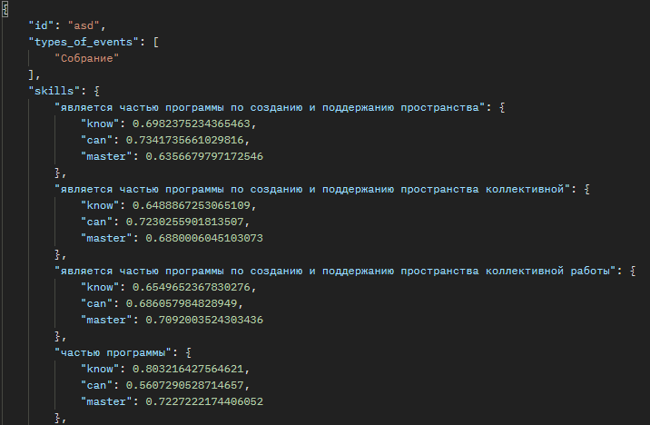

# Использованные модели

<b>nlp_type_of_event_extraction</b> $-$ pipeline для spacy.nlp достающий тип мероприятия (лекция, совещание, встреча и т.д.) из предложения.
 
<b>nlp_classic</b> $-$ pipeline для spacy.nlp представляющий из себя класический ru_core_news_sm pipeline.
 
<b>kcm_extraction_model</b> $-$ модель декодирующая вектор spacy в вектор kcm (знать, уметь, владеть)
 
<b>is_description_model</b> $-$ модель проверяющая является ли входной текст дескриптором или нет, возвращая степень уверенности в этом.

***
# Входные данные

json-файл состоящий из:
- id $-$ индентификатор студента;
- name_of_event $-$ названия мероприятия;
- event_description $-$ описание мероприятия;

## Пример входных данных
{ 
$~~~~$ `"id"`: "asd",
 
$~~~~$ `"name_of_event"`: "Собрание по петухону",
 
$~~~~$`"event_description"`: "Курс является частью программы по созданию и поддержанию пространства коллективной работы «Предпринимательские Точки кипения», реализуемой в рамках федерального проекта «Платформа университетского технологического предпринимательства» при поддержке Министерства науки и высшего образования Российской Федерации и АНО «Платформа НТИ»."
}

***
# Возвращает
json-файл состоящий из:
- id $-$ индентификатор студента;
- types_of_events $-$ тип(ов) мероприятия;
- skills $-$ наименования извлечённых дескрипторов / kcm;

## Пример выходных данных
